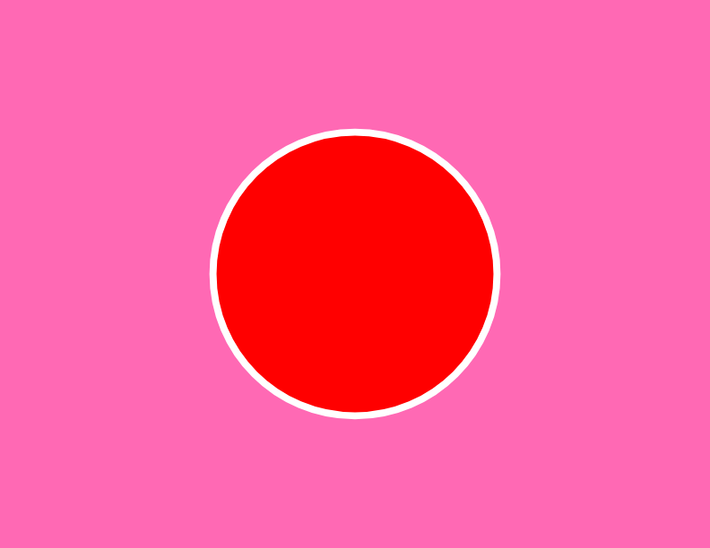

This repo explores ways of generating 2D art using canvas-sketch-cli

canvas-sketch-cli is a great tool for creating 2d artwork on canvas that is then easy to export or print

- sketch.js > some canvas-sketch npm package basics 
