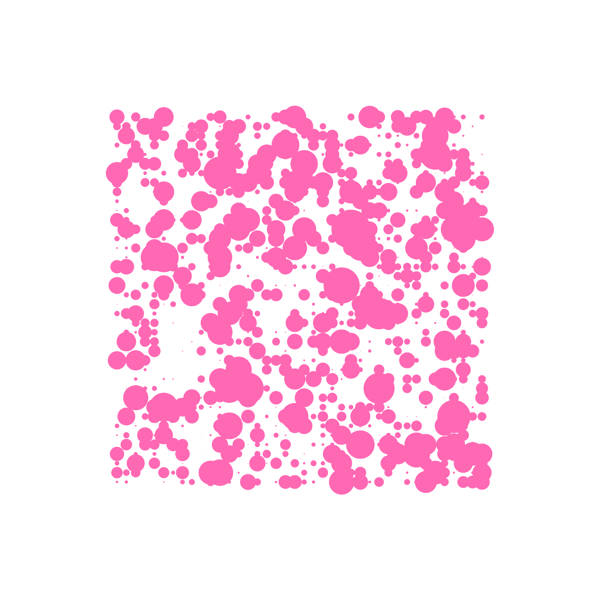

This repo explores ways of generating 2D art using canvas-sketch-cli based on Frontend Masters course [Creative Coding with Canvas & WebGL](https://frontendmasters.com/courses/canvas-webgl/)

canvas-sketch-cli is a great tool for creating 2d artwork on canvas that is then easy to export or print

- sketch.js > some canvas-sketch npm package basics 
- grid.js > makes a simple grid and margins using lerp function from canvas-sketch-util/math library 
- random.js > applies a random utility to the simple grid 
- organic-randomness.js > applies a two forms of randomness to the grid, both in terms of radius (gaussian) and appearance(regular) 
- colors.js > uses a library with pre-selected color palettes, and then applies randomness to the colors every time you refresh   
